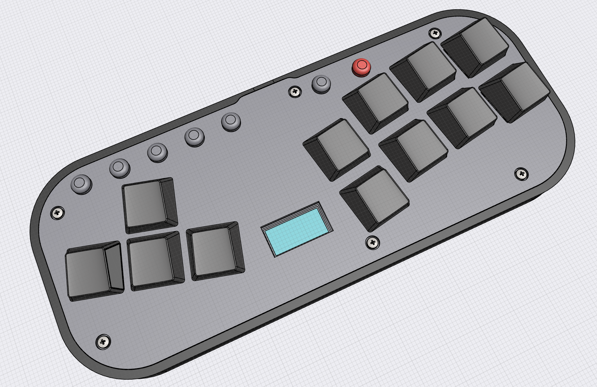
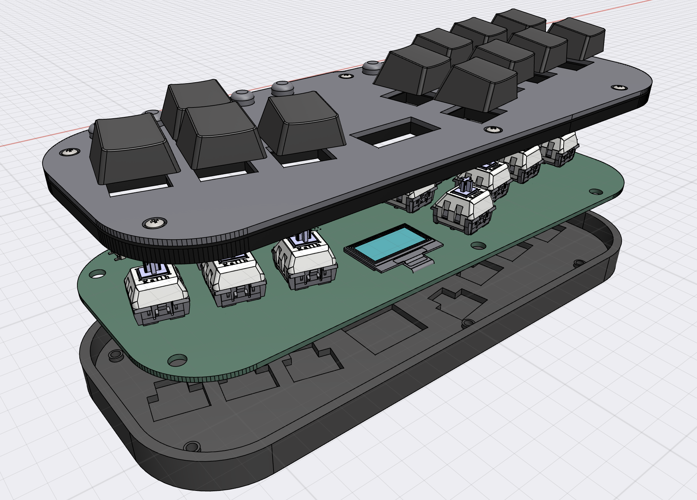

## FightingBox-Mini

 FightingBox-Mini gamepad is based on the GP2040-CE which compatible with PC, PS3 and PS4, Nintendo Switch, Steam Deck, MiSTer and Android.

## Links

[Downloads](https://gp2040-ce.info/#/download) | [Installation](https://gp2040-ce.info/#/installation) | [Wiring](https://gp2040-ce.info/#/wiring) | [Usage](https://gp2040-ce.info/#/usage) | [FAQ](https://gp2040-ce.info/#/faq)

Full documentation can be found at <https://gp2040-ce.info>

